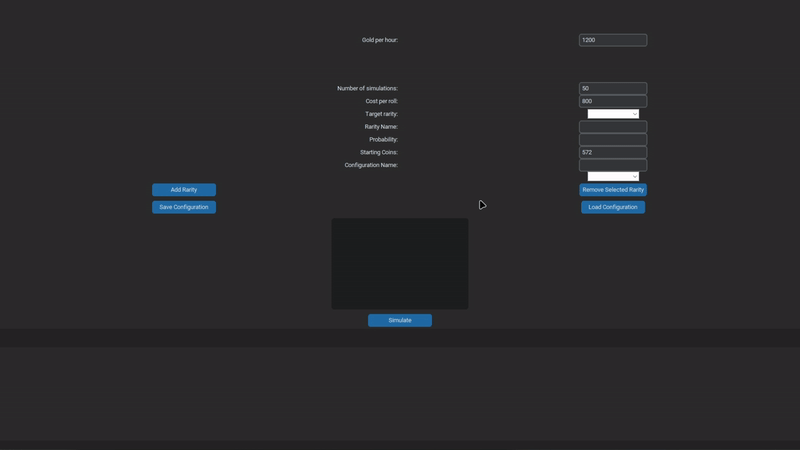
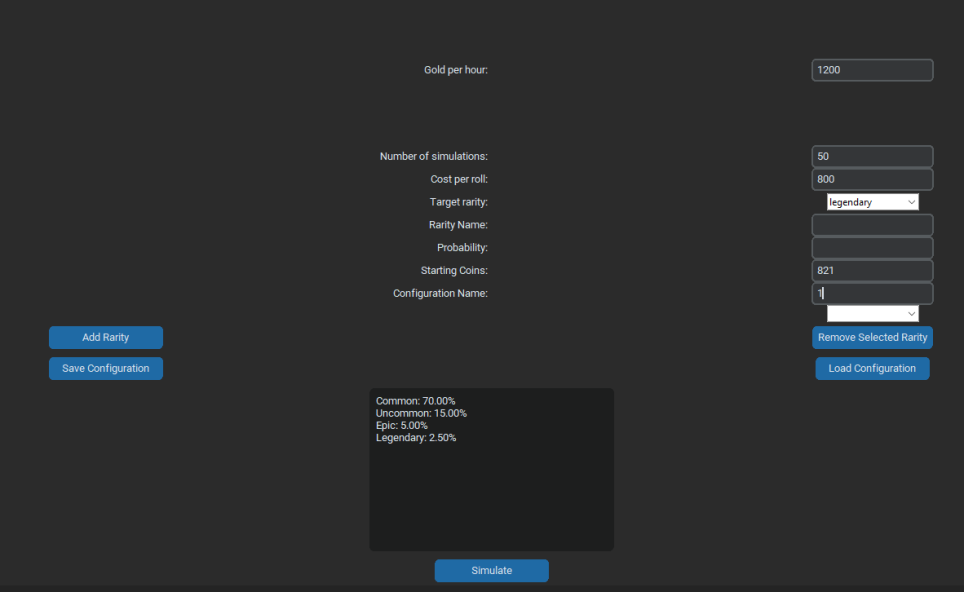

# Rarity Simulator 🎲


[](https://www.python.org/)
[](LICENSE)
[](https://github.com/TomSchimansky/CustomTkinter)

Rarity Simulator is a Python-based GUI tool for simulating "rolls" to obtain items with various rarities. This tool can help players understand the probabilities and costs involved in games with rarity-based roll mechanics.

---

## Features ✨

- **Add Custom Rarities**: Create and configure custom rarity names and probabilities.
- **Probability Simulation**: Run multiple simulations to estimate the cost and time required to obtain a target item.
- **Configuration Save/Load**: Easily save and load rarity configurations for different games or scenarios.
- **Detailed Results Display**: View average rolls, cost, and time estimates with a breakdown of roll results.

## Demo
 <!-- Put a GIF showing how to use the simulator -->

## Installation 🛠️

# Option 1

1. Clone this repository:
    ```bash
    git clone https://github.com/noobgokf1/RaritySimulator.git
    ```
2. Install dependencies:
    ```bash
    pip install -r requirements.txt
    ```
3. Run the simulator:
    ```bash
    python roll.py
    ```
# Option 2
1. Go to [Releases](https://github.com/noobgokf1/RaritySimulator/releases)
2. Download Roll.exe
3. Open Roll.exe


## Usage 📖

1. **Configure Rarities**:
   - Add rarities with a name and probability percentage (up to 100% total).
   - Save and load configurations for easy access to frequently used setups.

2. **Simulation Setup**:
   - Define parameters such as target rarity, cost per roll, number of simulations, starting coins, and income rate.
   
3. **Run Simulation**:
   - Press "Simulate" to get an estimated number of rolls, cost, and required time to achieve your target rarity.

## Example Configuration and Simulation


## Code Overview 🧩

This project includes:
- **Rarity and Configuration Management**: Functions to add/remove rarities and manage multiple configurations.
- **Simulation Logic**: Core logic to determine cost, time, and rolls to acquire a target item based on probability.
- **User Interface**: A graphical interface built with CustomTkinter, organized in logical frames and widgets.

### Key Functions
- `add_rarity()`: Adds a rarity to the current configuration with a specified probability.
- `simulate()`: Runs simulations based on user inputs and displays results including average rolls and time required.
- `save_config()` & `load_config()`: Saves and loads configurations for quick access.

## Folder Structure 📂
```plaintext
.
├── roll.py   # Main simulator code
├── configurations/            # Saved configurations (JSON)
├── requirements.txt
├── assets/                    # Banners, screenshots, etc.
└── README.md
```
## Contributing 🤝
Contributions are welcome! Please feel free to submit issues, fork the repository, and make a pull request.

## License 📝
This project is licensed under the MIT License - see the [License](LICENSE) file for details.
